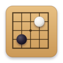

<!--
SPDX-FileCopyrightText: 2026 Elias Khanzada
SPDX-License-Identifier: GPL-3.0-or-later
-->

# Stones



A Go board in a libadwaita window, written in Haskell. It plays against
GNU Go.

## What it does

You click a point and a stone goes down. GNU Go answers. The board
counts the captures, closes a ko for a move, ends the game after two
passes, and asks GNU Go what the score was.

A tab opens on a page that asks what to play: the board, the colour you
take, and how hard the opponent should try. Nothing starts until you
press the button on it. Until then there is no game and no process, and
the program has nothing to guess with.


The window holds a tab per game. New Game opens another tab, on the
same page, already asking for whatever you started last. Each game has
a GNU Go of its own, because one GNU Go holds one board. Closing a tab
stops the GNU Go that was playing in it, and closing the last tab
closes the window.

The window is a header bar over a board, and nothing else, which is the
shape the GNOME games have. Undo is at the start of the bar and Pass is
at the end, because those are the two a player reaches for while
playing. Resign and New Game are in the menu in the corner. The title
says whose turn it is, and the line under it carries the numbers: the
board, and how many stones each player has taken.

## What is not code

`data` holds the files the program reads rather than the ones it is
compiled from:

```
data/icons/hicolor/scalable/apps/com.github.enzuru.Stones.svg
data/icons/hicolor/symbolic/apps/com.github.enzuru.Stones-symbolic.svg
data/com.github.enzuru.Stones.desktop
data/ui/menu.blp
data/ui/menu.ui
```

The menu is markup because a menu is data rather than widgets: a
`GMenuModel` has no widget in it at all. `menu.blp` is the source and
`menu.ui` is what the program reads. `make ui` compiles one into the
other with `blueprint-compiler`, and both are checked in, so a copy
built with cabal alone runs without that compiler installed.

Nothing else is markup. The rest of the window is a function of the
state that the declarative layer patches, and a `GtkBuilder` tree is
built once and mutated by hand, so the two do not mix well. The page a
tab opens on is the one place that would read better as markup today,
and the reason is that this library has no instances for
`AdwPreferencesGroup` or `AdwToggleGroup`. That is asked for as item 8
of `CHANGES-FOR-STONES.md` in the library's repository, and it would
make the page shorter in Haskell than it would be in Blueprint.

An installed copy is found by name, because its icon sits in a
directory the theme already looks in. A copy being worked on is not, so
the program adds `data/icons` beside the working directory to the ones
the theme looks in. `STONES_DATA_DIR` says where that directory is if
it is somewhere else.

## Building

You need GTK 4, libadwaita, the GObject introspection data for both,
GHC, and GNU Go. The flake has all of them:

```
nix develop
make check
make run
```

Inside that shell, `make stones` builds the program at `.build/stones`,
and `make check` runs the tests. `cabal build all` and
`cabal test stones-tests` work there too, and `cabal.project` names the
same source directories the Makefile does.

The declarative GTK 4 layer this is built on lives in a checkout beside
this one, at `../gi-gtk-declarative`. Point the Makefile somewhere else
with `make DECLARATIVE=/path/to/it`.

## Running

```
stones [options]

  --size <n>       Board width, from 2 to 19. The default is 19.
  --black          Play Black, which moves first. This is the default.
  --white          Play White, so the engine opens.
  --strength <name>  Gentle, Fair or Fierce. The default is Fierce.
  --engine <path>  The GNU Go program to run. The default is gnugo.
  --help           Print this and stop.
```

The command line does not start a game. It says what the first page
should already be asking for, which is for somebody who plays the same
game every time.

## How it is put together

```
Go.Types              The colours, a point, a move, and why a move was refused.
Go.Board              One position, and what a stone does to it.
Go.Game               A game: whose turn, ko, passing, and taking a move back.
Go.Vertex             The names the Go Text Protocol gives to points.

Stones.Engine         What the program needs from an opponent, and where
                      a new game gets one.
Stones.Engine.Gtp     Talking to a program over the Go Text Protocol.
Stones.Engine.GnuGo   GNU Go as an opponent.

Stones.Goban.Geometry Where the lines and the stones go.
Stones.Goban          The board, as a widget that draws itself with cairo.
Stones.Session        One game, and what each thing the player does turns
                      it into.
Stones.Setup          What a game is started from, and the page that asks.
Stones.Menu           The menu in the corner, and the actions it names.
Stones.Files          Where the files that are not code live.
Stones.App            The tabs, the window, and where each answer belongs.
```

There are three sets of tests, and `make check` runs all three.

`test/` needs nothing. The rules, the names, and the geometry are pure
functions; the board is drawn onto a cairo surface in memory and the
pixels are read back; `Stones.Session` and `Stones.App` are driven as
state machines against an opponent that is a record of answers; and the
protocol is checked against engines that are shell scripts, which can
be made to refuse, to babble, or to die. One test starts a real GNU Go
and plays a few moves against it, and says so and passes if there is
none on the machine.

`widget-test/` needs GTK, and runs under a nested X server. It builds
the window for real and reads it back: that the tree is one GTK
accepts, that a move patches the window rather than rebuilding it, and
that the board keeps its widget and its controllers across a patch.

`tests/gui-input.sh` needs GTK and `xdotool`. GTK 4 reports a click
through a gesture, and nothing in it can make one happen from code, so
this is the only way to reach the path from a click on the board to a
stone on the board. It starts the window, clicks on it, and reads back
where the stones went. It is driven from the Makefile rather than from
cabal, because cabal has no way to run a test that needs a display and
a program to click with.

`make coverage` says what they all reach. It builds each of the three a
second time with GHC's own coverage counting and adds the runs up, so
it is not part of `make check`. It stands at 94% of expressions, and
what is left is mostly instances the compiler wrote and attribute names
that are types rather than values.

The program keeps the rules itself and also tells the engine about every
move, so both hold the same position. Two boards rather than one is what
makes a click land at once: the stone appears without waiting for a
process to think. If the two ever disagree, the game stops and says so,
rather than playing on from a position only half of the program believes
in.

A tab is either choosing or playing, and a game's opponent is in one of
four states, which `Stones.Session` names: starting, idle, waiting for
an answer, or gone. One value rather
than a handful of flags, so that a game cannot be starting and broken at
the same time, and so that a move can only be played where there is
something to play it against.

Almost everything the window says is worked out from the game and from
its opponent, rather than stored as a line of text. A game keeps only
the two things that are written nowhere else: the score at the end, and
the reason the rules would not take the last stone.

The records have no field selectors. `OverloadedRecordDot` and
`NoFieldSelectors` are on everywhere, so a field is read as
`session.game.turn` and there is no `sessionGame` function to collide
with anything. That is why a field can be called `board` in three
records at once, and why the one place that needs a selector as a value
writes it as a section, `(.close)`.

A game is a part of the window, and it says so in its type. Its update
answers with a `Transition Session SessionEvent`, and the window lifts
that into one of its own:

```haskell
inTab state tab move = bimap putBack (InTab tab) (move session)
```

Nothing a game asks of its opponent runs under a name. A named job
stops whatever was running under that name, and what a game asks for is
several lines of protocol: one stopped between two of them would leave
the answer to the first in the pipe, to be read as the answer to
whatever was asked next. A window that did name them would need
`qualifying` as well, because a name is shared by everything the loop
runs and this window holds a game per tab.

## Playing on a server

Everything the program asks of an opponent is one of the seven actions
in `Stones.Engine`: set up a board, take a move, give a move, take moves
back, give a score, and let go. Where a tab gets one is the `Opponents`
record beside it. GNU Go is one such opponent, and a game on
[online-go.com](https://online-go.com/) is meant to be the next one, in
a tab beside a game against GNU Go.

That seam carries the moves, and a server needs more than the moves: a
list of games to join, a clock, and a connection that pushes the
opponent's move rather than being asked for it. The push has a place to
go already, because `GI.Gtk.Declarative.App.Simple` has subscriptions,
which is how a socket feeds events into the window. The rest is not
written yet.

## License

GNU General Public License, version 3 or later. The full text is in
[LICENSE](LICENSE), and every source file says so at the top.

The declarative GTK 4 layer this is built on is a separate program, in
a checkout of its own, under the Mozilla Public License 2.0. That
license is written to allow this: a work combining MPL-2.0 code with
GPL code may be distributed under the GPL, unless the MPL files carry
the notice saying otherwise, and these do not. Those files stay under
the MPL for their own terms, and their notices stay with them.
