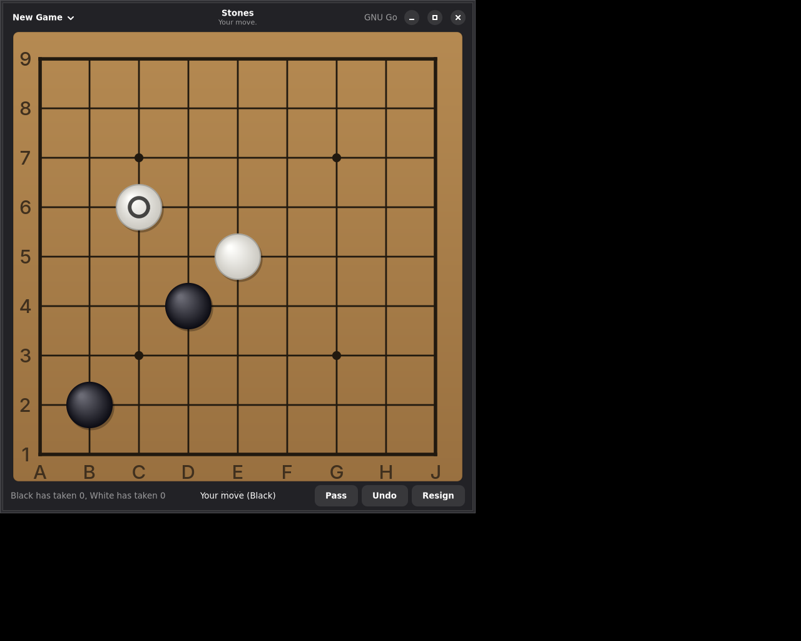

# Stones

A Go board in a libadwaita window, written in Haskell. It plays against
GNU Go.



## What it does

You click a point and a stone goes down. GNU Go answers. The board
counts the captures, closes a ko for a move, ends the game after two
passes, and asks GNU Go what the score was.

The window has a board of 9x9, 13x13 or 19x19, a Pass button, an Undo
button that takes back your move and the answer to it, and a Resign
button.

## Building

You need GTK 4, libadwaita, the GObject introspection data for both,
GHC, and GNU Go. The flake has all of them:

```
nix develop
make check
make run
```

Inside that shell, `make stones` builds the program at `.build/stones`,
and `make check` runs the tests. `cabal build all` and
`cabal test stones-tests` work there too, and `cabal.project` names the
same source directories the Makefile does.

The declarative GTK 4 layer this is built on lives in a checkout beside
this one, at `../gi-gtk-declarative`. Point the Makefile somewhere else
with `make DECLARATIVE=/path/to/it`.

## Running

```
stones [options]

  --size <n>       Board width, from 2 to 19. The default is 19.
  --black          Play Black, which moves first. This is the default.
  --white          Play White, so the engine opens.
  --level <n>      How hard GNU Go thinks, from 1 to 10. The default is 10.
  --engine <path>  The GNU Go program to run. The default is gnugo.
  --help           Print this and stop.
```

## How it is put together

```
Go.Types              The colours, a point, a move, and why a move was refused.
Go.Board              One position, and what a stone does to it.
Go.Game               A game: whose turn, ko, passing, and taking a move back.
Go.Vertex             The names the Go Text Protocol gives to points.

Stones.Engine         What the program needs from an opponent.
Stones.Engine.Gtp     Talking to a program over the Go Text Protocol.
Stones.Engine.GnuGo   GNU Go as an opponent.

Stones.Goban.Geometry Where the lines and the stones go.
Stones.Goban          The board, as a widget that draws itself with cairo.
Stones.App            The window, and what each event does to it.
```

The tests are in `test/`. The rules and the geometry are checked as pure
functions, `Stones.App` is driven as a state machine with a fake engine
in place of a real one, and one test starts a real GNU Go and talks to
it. None of them need a display.

The program keeps the rules itself and also tells the engine about every
move, so both hold the same position. Two boards rather than one is what
makes a click land at once: the stone appears without waiting for a
process to think. If the two ever disagree, the game stops and says so,
rather than playing on from a position only half of the program believes
in.

## Playing on a server

Everything the program asks of an opponent is one of the seven actions
in `Stones.Engine`: set up a board, take a move, give a move, take moves
back, give a score, and let go. GNU Go is one such opponent. A game on
[online-go.com](https://online-go.com/) is meant to be the next one.

That seam carries the moves, and a server needs more than the moves: a
list of games to join, a clock, and a connection that pushes the
opponent's move rather than being asked for it. The push has a place to
go already, because `GI.Gtk.Declarative.App.Simple` has subscriptions,
which is how a socket feeds events into the window. The rest is not
written yet.

## License

Mozilla Public License 2.0. The declarative GTK layer is Oskar
Wickström's, under the same license.
